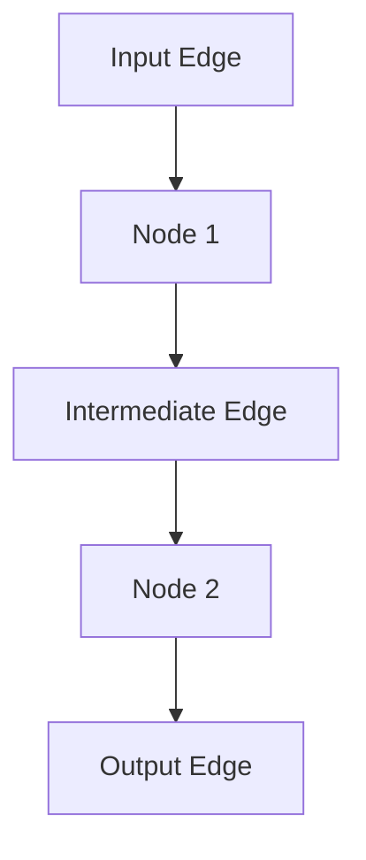

# SolverGraph Overview

## Introduction

The **solvergraph** architecture in Shamrock is a modern, graph-based system for organizing the flow of data and computations in simulation solvers. It replaces the legacy module/component system with a more explicit, extensible, and debuggable structure. Solvergraphs make data dependencies and computational steps transparent, modular, and easier to maintain.

---

## Motivation

- **Explicit Data Flow:** Clearly represent how data moves and transforms through the solver.
- **Modularity:** Encapsulate computations and data as reusable, composable graph elements.
- **Debuggability:** Visualize and inspect the computation graph for easier debugging and optimization.
- **Memory Management:** Enable more efficient and explicit memory handling.

---

## Core Concepts

### 1. Edges (Data)

Edges represent data containers and dependencies in the graph. They are the links between computational steps (nodes).

- **Types of Edges:**
  - `ScalarEdge<T>`: Scalar values
  - `Indexes<T>`: Index arrays
  - `Field<T>`: Distributed fields with automatic memory management
  - `FieldRefs<T>`: References to existing fields
  - Custom edges: Inherit from `IDataEdgeNamed` for specialized data

**Example:**
```cpp
std::shared_ptr<shamrock::solvergraph::Field<T>> my_field =
    std::make_shared<shamrock::solvergraph::Field<T>>(nvar, "field_name", "\\phi");
```

### 2. Nodes (Computation)

Nodes are the computational units of the solvergraph. Each node consumes input edges and produces output edges.

- **Base Class:** `shamrock::solvergraph::INode`
- **Responsibilities:**
  - Connect to input (read-only) and output (read-write) edges
  - Implement the computation in `_impl_evaluate_internal()`
  - **Provide graph visualization and labeling:**
    - Each node can generate a label (for display in graphs and logs) by implementing `_impl_get_label()`.
    - Nodes can output their structure in DOT graph format (for tools like Graphviz) via methods like `get_dot_graph_partial()` and `get_dot_graph_node_start()/get_dot_graph_node_end()`.
    - Nodes can also provide LaTeX representations for documentation or publication-quality diagrams via `_impl_get_tex()`.
    - This enables automatic generation of visual representations of the solvergraph, making it easier to debug, document, and understand the flow of computations.

**Example:**
```cpp
class MyNode : public shamrock::solvergraph::INode {
    // Store typed pointers to edges
    std::shared_ptr<MyEdgeType> input;
    std::shared_ptr<MyEdgeType> output;
public:
    // Custom set_edges method
    void set_edges(std::shared_ptr<MyEdgeType> in, std::shared_ptr<MyEdgeType> out) {
        input = in;
        output = out;
        __internal_set_ro_edges({in});
        __internal_set_rw_edges({out});
    }
    void _impl_evaluate_internal() override {
        output->data = input->data * 2;
    }
    std::string _impl_get_label() override { return "MyNode"; }
    std::string _impl_get_tex() override { return "MyNodeTex"; }
    std::string _impl_get_dot_graph_partial() override {
        return "n_" + std::to_string(get_uuid()) + " [label=\"My Custom Node\"]\n";
    }
};
```

Visualization support is built into the solvergraph system, so developers can easily generate and inspect the computation graph using standard tools, improving both development and maintenance workflows.

---

## How to Use Solvergraphs

### 1. Define Edges
Choose or implement the appropriate edge type for your data. For custom data, inherit from `IDataEdgeNamed` and implement memory management if needed.

### 2. Define Nodes
Inherit from `INode` and implement the computation logic. Set up input/output edges using `set_edges(...)`.

### 3. Build the Graph
Create nodes and edges, connect them, and assemble them into a sequence (e.g., using `OperationSequence`).

**Example:**
```cpp
// Create edges
auto input = std::make_shared<shamrock::solvergraph::ScalarEdge<double>>("in", "in");
auto output = std::make_shared<shamrock::solvergraph::ScalarEdge<double>>("out", "out");

// Create node
class DoubleNode : public shamrock::solvergraph::INode {
    // Store typed pointers to edges
    std::shared_ptr<shamrock::solvergraph::ScalarEdge<double>> input;
    std::shared_ptr<shamrock::solvergraph::ScalarEdge<double>> output;
public:
    // Custom set_edges method
    void set_edges(std::shared_ptr<shamrock::solvergraph::ScalarEdge<double>> in,
                   std::shared_ptr<shamrock::solvergraph::ScalarEdge<double>> out) {
        input = in;
        output = out;
        // Register with base class for graph traversal/visualization
        __internal_set_ro_edges({in});
        __internal_set_rw_edges({out});
    }
    void _impl_evaluate_internal() override {
        output->set_value(input->get_value() * 2);
    }
    std::string _impl_get_label() override { return "DoubleNode"; }
    std::string _impl_get_tex() override { return "DoubleNodeTex"; }
};
auto node = std::make_shared<DoubleNode>();
node->set_edges({input}, {output});

// Visualization and documentation
std::string tex_repr = shambase::get_check_ref(node).get_tex(); // LaTeX representation
std::string dot_repr = shambase::get_check_ref(node).get_dot_graph(); // DOT graph representation

// Build sequence
auto sequence = std::make_shared<shamrock::solvergraph::OperationSequence>(
    "Double Sequence", std::vector{node});

// Evaluate
double val = 3.0;
input->set_value(val);
sequence->evaluate();
double result = output->get_value(); // result == 6.0
```

---

## Memory Management

- Edges can implement custom memory management via `free_alloc()`.
- The graph can include special nodes (e.g., `NodeFreeAlloc`) to explicitly free memory when data is no longer needed.

---

## Visualization

Solvergraphs support DOT graph and LaTeX output for visualization and documentation. Each node and edge can provide labels and graph representations, making it easy to inspect the computation flow.

---

## Migration Tips

- Replace legacy `Component<T>` with the appropriate solvergraph edge type.
- Replace legacy modules with nodes inheriting from `INode`.
- Use `OperationSequence` to group nodes into logical subgraphs.
- Implement memory management in custom edges as needed.
- For a step-by-step migration process, see the [SolverGraph Migration Guide](solvergraph_migration_guide.md).

---

## Diagram



---

## Conclusion

Solvergraphs provide a powerful, modular, and debuggable way to organize simulation logic in Shamrock. By making data flow and computation explicit, they enable better maintainability, extensibility, and performance.
